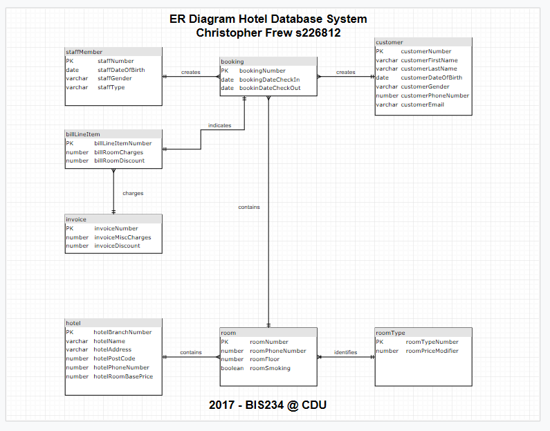

# Sample Entity Relationship diagram 

During my university degree, I architected a number of relational databases, including this example. This is a [draw.io](https://draw.io) diagram in .xml format. This is a system for a hotel management database in 3rd normal form.

